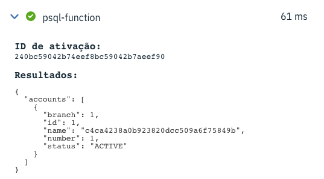

# psql-function

Native serverless function with PostgreSQL.

The idea behind this function is to prove a concept about creating serverless functions quickly no matter your programming language.

In that example, we are using bash script and psql to create a serverless function that gets an account in the database.

## Prerequisites

* IBM Cloud account
* IBM Cloud CLI (https://cloud.ibm.com/functions/learn/cli)
* PostgreSQL instance (You may use the Databases for PostgreSQL in the IBM Cloud)
* Docker

## Setup

* Create the database structure contained in the `schema.sql` file in your PostgreSQL instance.
* Configure the `exec` file with your credentials to the PostgreSQL instance
```bash
HOSTNAME=""
PORT=""
USERNAME=""
PASSWORD=""
PGPASSWORD=""
PGSSLROOTCERT=""
```

## Creating your function

Build your Docker image:
```
docker build -t epiresdasilva/psql-function .
```

Tag the docker image:
```
docker tag epiresdasilva/psql-function epiresdasilva/psql-function:0.0.1
```

Push the docker image to the Docker hub:
```
docker push epiresdasilva/psql-function:0.0.1
```

Create the function in the IBM Cloud:
```
ibmcloud fn action create psql-function --docker epiresdasilva/psql-function:0.0.1
```

PS: Replace `epiresdasilva` with your username in the docker hub

## Running

You must pass as payload the branch and account number, exactly like that:
```json
{"branch": 1, "number": 1}
```

You'll get a response like that:

